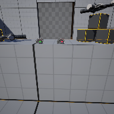

# Project Name  VRSampleMod3

## Description

A github repository for the in class demonstration code based on UE default Virtual Reality template.Demonstrates an interactive button and controllable door and light   
 
## Usage
Clone, or download the zip, to a local directory. Open in Unreal Engine 5.4 or newer

## Attributions

